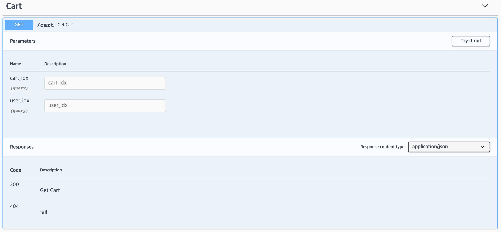

# Swagger
## Authored by Jungeun Pyun
### Authored on 2021. Feb. 28.

기존에 생성한 API들이 swagger에서 동작하도록 swagger 파일을 추가한 코드이다.
swagger는 백엔드 엔지니어와 프론트엔드 엔지니어와의 원활한 의사소통을 위해 API 스펙에 관한 내용을 보다 쉽게 확인할 수 있도록 작성한 문서이다.
 
swagger를 사용하기 위해 두 가지 모듈을 설치하였다.
1. swagger-ui-express
2. swagger-ui-jsdoc

- 전체 swagger에 대한 설정은 app.js 내부에 해두었다.
- swagger 파일들은 schemas라는 폴더안에 저장하였다.
- 작성한 swagger api들은 localhost:4000/api-docs로 들어가서 확인할 수 있다.

swagger 페이지에 들어가면 첫 화면은 다음과 같다.       

         
cart 부분의 get과 post를 확인해보면 다음과 같다. 

         

관련 내용은 블로그에도 정리해 두었다 : [블로그링크](https://jungeunpyun.tistory.com/35) 